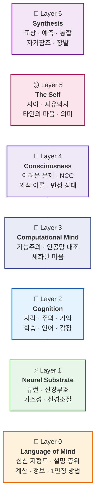
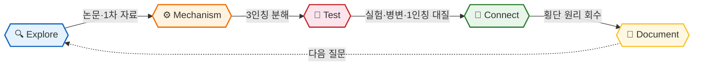

<h1 align="center">
  
  IQ Psyche Lab
</h1>

**물질에서 마음을 쌓아 올리고, 끝내 환원되지 않는 '경험'을 정직하게 마주하는 연구소**

 

 

> *"Explain it, don't explain it away."*

**"이 모든 걸 아는 '나'는 무엇일까?"**

대중 심리학과 뇌 다큐멘터리가 *신기한 현상*에서 멈출 때, 이 연구소는 한 걸음 더 들어갑니다  
— 뉴런이라는 가장 단단한 바닥에서 *경험하는 나 자신*까지, 마음을 한 층씩 쌓아 올려 설명합니다.  
그리고 **설명이 끝내 닿지 못하는 곳**(왜 거기에 '느낌'이 있나)을 지우지 않고 정직하게 표시합니다.

그래서 모든 글은 같은 흐름으로 끝납니다 —
**메커니즘**(어떻게 작동하나) → **간극**(어디서 설명이 끊기나) → **경험**(그래서 무엇이 느껴지나).

---

## 🏛️ The Knowledge Pentad

아리스토텔레스는 지적 덕(intellectual virtue)을 다섯으로 나눴습니다  
— Techne · Episteme · Phronesis · Nous · Sophia.  
앞의 네 연구소가 그 덕들로 *세계를 바깥으로* 바라본다면(제작·증명·판단·환원), 이 다섯 번째 연구소는 방향을 **안으로** 돌립니다.

왜냐하면 그 모든 덕은 결국 *마음(ψυχή)의 능력*이기 때문입니다.  
아리스토텔레스의 『영혼에 관하여』(De Anima, *Περὶ Ψυχῆς*)는 *무엇을 아는가*가 아니라 **아는 자 그 자체**를 다룹니다.  
Psyche Lab은 그 반성적 전환 — 앎이 마침내 *자기 자신의 자리*를 되돌아보는 곳입니다.

| | 앎의 형태 | 핵심 질문 | 연구소 |
|:--:|:----------|:----------|:-------|
| 📐 | **Episteme** — 증명 가능한 이론지 | *왜 참인가?* | [**IQ AI Lab**](https://github.com/iq-ai-lab) · "Prove, don't memorize" |
| 🔧 | **Techne** — 만들어내는 기예지 | *어떻게 동작하는가?* | [**IQ Dev Lab**](https://github.com/iq-dev-lab) · "Beyond the docs" |
| 🧭 | **Phronesis** — 상황 속에서 판단하는 실천지 | *그래서 무엇을 하는가?* | [**IQ Phronesis Lab**](https://github.com/iq-phronesis-lab) · "Distill, don't collect" |
| 🌌 | **Sophia** — 제1원리에서 실재를 이해하는 이론적 지혜 | *무엇이 근본이며, 왜 이렇게 존재하는가?* | [**IQ Physis Lab**](https://github.com/iq-physis-lab) · "Derive, don't accept" |
| 🧠 | **Psyche** — 모든 앎이 깃드는 마음 그 자체 *(덕이 아니라, 덕의 자리)* | *아는 자는 무엇이며, 경험은 어떻게 생기는가?* | **IQ Psyche Lab** · "Explain it, don't explain it away" |

> 수학은 **증명**으로, 시스템은 **측정**으로, 실천지는 **반례**로, 자연은 **실험**으로 검증합니다.
> 마음은 세 가지로 검증합니다  
> — **실험**(3인칭으로 측정) · **현상학**(1인칭 경험을 정밀히 기술) · **계산 모델**(직접 만들어 재현).  
> 그리고 이 셋이 *끝내 들어맞지 않는 지점*을 지우지 않습니다 — 그게 이 연구소의 규율입니다.
>
> Sophia(Physis Lab)가 *세계가 무엇으로 이루어졌는지*를 관찰자 앞에서 멈춰 재구성했다면, Psyche Lab은 바로 그 **관찰자**를 엽니다.  
> 두 연구소는 같은 솔기의 양쪽 — 한쪽은 *우주*를, 다른 쪽은 *우주를 보는 눈*을 다룹니다.

---

## 🗺️ Architecture — 7-Layer Stack

이 연구소는 분야를 나열한 목록이 아니라, **뉴런(맨 아래)에서 자아(맨 위)까지 한 층씩 쌓아 올린 스택**입니다.  
여섯 개의 원리(**표상 · 예측 · 통합 · 자기참조 · 체화 · 창발**)가 모든 층에 거듭 나타납니다.

> **완성의 기준** — "분야를 다 모았나"가 아니라 **"표상·예측·통합·자기참조·창발이 모든 레이어에서 최소 한 번씩 회수됐나"**.
> 새 발견(새 이론·새 뇌 영역)이 나와도 *새 분야*가 아니라 *기존 레이어의 한 칸*으로 들어갑니다.

---

## 📚 Projects & Studies

### 🧠 Layer 0 — Language of Mind &nbsp;마음을 탐구하는 자의 모국어

&nbsp;🧠 &nbsp;<b>Language of Mind</b> &nbsp;&nbsp;

 

> 모든 레이어가 다시 가져다 쓰는 *사고의 언어* — 마음을 신비가 아니라 **분석 가능한 대상**으로 다루기 위한 도구

| &nbsp; | 📌 Title | 📝 Key Topics |
|:--:|:---------|:----------|
| 1 | [**The Mind–Body Map Distilled**](https://github.com/iq-psyche-lab/mind-body-map-distilled) | **마음과 물질은 어떻게 관계 맺나** — 이원론·물리주의·기능주의의 정직한 비교, 설명적 간극, 좀비 논변·메리의 방, 왜 이 문제가 2천 년째 안 풀리나 `34docs` |
| 2 | [**Levels of Explanation Distilled**](https://github.com/iq-psyche-lab/levels-of-explanation-distilled) | **"뉴런이 곧 마음"은 왜 범주오류인가** — Marr의 세 층위(계산·알고리즘·구현), 다중실현가능성, 환원의 정확한 의미, 어느 층에서 설명해야 하나 `33docs` |
| 3 | [**Computation & Representation Distilled**](https://github.com/iq-psyche-lab/computation-representation-distilled) | **물질이 어떻게 *무언가에 관한 것*이 되나** — 지향성, 처치-튜링, 기호 vs 분산 표상, 표상이 없으면 마음도 없나 `35docs` |
| 4 | [**Information & Prediction Distilled**](https://github.com/iq-psyche-lab/information-prediction-distilled) | **마음을 정보로 보는 렌즈** — 정보이론 기초, 베이즈 추론, 자유에너지 원리의 직관, 뇌는 왜 *추론 기계*인가(→ [IQ AI Lab](https://github.com/iq-ai-lab) 교차) `34docs` |
| 5 | [**Methods for the First Person Distilled**](https://github.com/iq-psyche-lab/first-person-methods-distilled) | **1인칭을 어떻게 과학으로 다루나** — 정신물리학, 내성(introspection)은 믿을 수 있나, 헤테로현상학, 신경상관물(NCC) 방법론과 그 한계 `33docs` |

 

---

### ⚡ Layer 1 — Neural Substrate &nbsp;뇌라는 물리 시스템: 환원의 가장 단단한 바닥

&nbsp;⚡ &nbsp;<b>Neural Substrate</b> &nbsp;&nbsp;

 

> 마음의 물리적 바닥 — 뉴런과 회로라는 *3인칭 기질*에서 시작합니다. 가장 단단하지만, **여기서 멈추면 '경험'을 놓칩니다**

| &nbsp; | 📌 Title | 📝 Key Topics |
|:--:|:---------|:----------|
| 1 | [**Neurons & Neural Codes Distilled**](https://github.com/iq-psyche-lab/neurons-neural-codes-distilled) | **정보는 뇌에서 어떻게 표현되나** — 활동전위·시냅스의 생물물리, 발화율 vs 시간 부호, 집단 부호화, 뉴런은 무엇을 *계산*하나 `35docs` |
| 2 | [**Brain Architecture Distilled**](https://github.com/iq-psyche-lab/brain-architecture-distilled) | **왜 뇌는 이렇게 조직됐나** — 피질·시상·기저핵·소뇌의 분업, 위계와 병렬, 기능 국재화의 진실과 신화, 연결체(connectome) `34docs` |
| 3 | [**Plasticity & Learning Distilled**](https://github.com/iq-psyche-lab/plasticity-learning-distilled) | **경험은 어떻게 물질에 새겨지나** — 헵 규칙·STDP, 기억의 물리적 흔적(engram), 생물학적 학습 vs 역전파(→ [IQ AI Lab](https://github.com/iq-ai-lab) 직결) `33docs` |
| 4 | [**Neuromodulation & Arousal Distilled**](https://github.com/iq-psyche-lab/neuromodulation-arousal-distilled) | **의식의 ON/OFF는 무엇이 켜나** — 도파민·세로토닌·아세틸콜린의 역할, 보상예측오차(→ AI RL 교차), 각성과 수면을 가르는 뇌간 스위치 `32docs` |

 

---

### 💭 Layer 2 — Cognition &nbsp;마음의 알고리즘: 지각 · 주의 · 기억 · 학습 · 언어 · 감정

&nbsp;💭 &nbsp;<b>Cognition</b> &nbsp;&nbsp;

 

> 신경 기질 위에서 창발하는 *기능* — "무엇으로 만들어졌나"가 아니라 "어떤 계산을 하나". 인지과학의 알고리즘 층

| &nbsp; | 📌 Title | 📝 Key Topics |
|:--:|:---------|:----------|
| 1 | [**Perception Distilled**](https://github.com/iq-psyche-lab/perception-distilled) | **본다는 것은 수신이 아니라 추론이다** — 예측처리로서의 지각, 착시가 폭로하는 뇌의 가정, 베이즈 지각, 왜 우리는 *해석된 세계*만 보나 `36docs` |
| 2 | [**Attention & Working Memory Distilled**](https://github.com/iq-psyche-lab/attention-working-memory-distilled) | **왜 우리는 한 번에 조금밖에 못 잡나** — 주의 = 한정 자원의 배분, 작업기억의 용량(7±2의 진실), 병목·선택·부주의맹시 `34docs` |
| 3 | [**Memory Distilled**](https://github.com/iq-psyche-lab/memory-distilled) | **기억은 재생이 아니라 재구성이다** — 부호화·인출·재응고, 기억 종류의 지도, 거짓기억이 쉬운 이유, 망각은 버그가 아니라 기능 `35docs` |
| 4 | [**Learning & Decision Distilled**](https://github.com/iq-psyche-lab/learning-decision-distilled) | **마음은 어떻게 가치를 계산하나** — 강화학습의 심리학(→ AI RL · → [IQ Phronesis Lab](https://github.com/iq-phronesis-lab) 결정 이론 교차), 습관 vs 목표지향, 시간 할인 `34docs` |
| 5 | [**Language & Concepts Distilled**](https://github.com/iq-psyche-lab/language-concepts-distilled) | **언어는 사고를 결정하나** — 개념·범주화, 사피어-워프 재검토, 합성성, 인간 언어 vs LLM(→ [IQ AI Lab](https://github.com/iq-ai-lab) NLP 교차) `33docs` |
| 6 | [**Emotion & Motivation Distilled**](https://github.com/iq-psyche-lab/emotion-motivation-distilled) | **감정은 합리의 적이 아니라 평가 시스템이다** — 신체표지가설, 내수용감각(interoception), 정동은 어디서 오나, 느낌 없는 결정은 왜 망가지나 `34docs` |

 

---

### 🧩 Layer 3 — The Computational Mind &nbsp;마음 = 계산? 가장 강력한 가설과 그 반론

&nbsp;🧩 &nbsp;<b>The Computational Mind</b> &nbsp;&nbsp;

 

> 마음을 *기질에서 독립한 계산*으로 보는 가설 — 그리고 그 가설이 부딪히는 벽. AI Lab과 가장 깊게 교차하는 층

| &nbsp; | 📌 Title | 📝 Key Topics |
|:--:|:---------|:----------|
| 1 | [**Computational Theory of Mind Distilled**](https://github.com/iq-psyche-lab/computational-mind-distilled) | **마음은 소프트웨어인가** — 기능주의, 중국어 방 논변(→ L0 심신문제), 다중실현가능성, "이해"와 "처리"는 같은가 `35docs` |
| 2 | [**Brains vs Artificial Networks Distilled**](https://github.com/iq-psyche-lab/brains-vs-networks-distilled) | **인공 신경망은 뇌를 얼마나 닮았나** — 생물망 vs 인공망의 같음과 다름, 역전파는 뇌에서 일어나나, 예측부호화 ↔ 딥러닝(→ [IQ AI Lab](https://github.com/iq-ai-lab) 직결) `36docs` |
| 3 | [**Embodied & Enactive Mind Distilled**](https://github.com/iq-psyche-lab/embodied-mind-distilled) | **마음은 뇌 안에만 있지 않다** — 4E 인지(체화·내장·행화·확장), 감각운동 우연성, 통 속의 뇌 비판, 몸 없는 계산의 한계 `33docs` |

 

---

### 🌌 Layer 4 — Consciousness &nbsp;환원이 가장 거세게 저항하는 곳: 이 연구소의 정점

&nbsp;🌌 &nbsp;<b>Consciousness</b> &nbsp;&nbsp;

 

> 모든 메커니즘이 도달하는 가장 깊은 질문 — *왜 거기에 느낌이 있는가*. 환원이 멈추는 지점을 **과대포장 없이, 그러나 지우지도 않고** 기록합니다

| &nbsp; | 📌 Title | 📝 Key Topics |
|:--:|:---------|:----------|
| 1 | [**The Hard Problem Distilled**](https://github.com/iq-psyche-lab/hard-problem-distilled) | **왜 정보 처리에 *느낌*이 따라붙나** — 쉬운 문제 vs 어려운 문제(Chalmers), 설명적 간극, 좀비·역전된 qualia, 이 Lab이 존재하는 이유 그 자체 `38docs` |
| 2 | [**Neural Correlates of Consciousness Distilled**](https://github.com/iq-psyche-lab/ncc-distilled) | **의식과 무의식을 가르는 신경 서명은 무엇인가** — 무의식적 처리와의 대조, 마취·식물상태·맹시(blindsight)가 알려주는 것, 의식의 측정 가능한 흔적 `36docs` |
| 3 | [**Theories of Consciousness Distilled**](https://github.com/iq-psyche-lab/theories-of-consciousness-distilled) | **전역작업공간 vs 통합정보 vs 고차이론 vs 예측처리** — 주요 이론의 정직한 비교, 각자가 내놓는 *반증 가능한* 예측, 무엇이 시험대에 올랐나 `37docs` |
| 4 | [**Altered & Edge States Distilled**](https://github.com/iq-psyche-lab/altered-states-distilled) | **의식이 흐트러질 때 그 구조가 드러난다** — 수면·꿈·마취·환각제·명상, 분리뇌(split-brain)의 충격, 변두리 상태로 의식의 경계를 측량하기 `34docs` |

 

---

### 🪞 Layer 5 — The Self &nbsp;이 모든 걸 아는 '나': 물질에서 마음으로의 정점

&nbsp;🪞 &nbsp;<b>The Self</b> &nbsp;&nbsp;

 

> 가장 위의 창발 — *경험하는 나 자신*. 자유의지·타인·죽음·의미까지, 1인칭이 끝까지 밀어붙여지는 곳. **검증이 닿는 곳과 닿지 못하는 곳을 정직하게 나눕니다**

| &nbsp; | 📌 Title | 📝 Key Topics |
|:--:|:---------|:----------|
| 1 | [**The Self & Self-Model Distilled**](https://github.com/iq-psyche-lab/self-model-distilled) | **'나'는 실체인가 과정인가** — 자기모델 이론(Metzinger), 신체적 자아 vs 서사적 자아, 고무손 착시, 자아는 뇌가 만든 유용한 환상인가 `36docs` |
| 2 | [**Free Will & Agency Distilled**](https://github.com/iq-psyche-lab/free-will-agency-distilled) | **리벳 실험은 정말 자유의지를 부정하나** — 결정론 vs 양립가능론, 행위주체감(sense of agency), 책임의 근거(→ [IQ Phronesis Lab](https://github.com/iq-phronesis-lab) 결정 이론 교차) `35docs` |
| 3 | [**Other Minds & Social Cognition Distilled**](https://github.com/iq-psyche-lab/other-minds-distilled) | **타인의 마음을 어떻게 아나** — 마음이론(ToM), 거울뉴런 신화의 검증, 공감의 메커니즘, 왜 사물에도 마음을 투사하나(→ [IQ Phronesis Lab](https://github.com/iq-phronesis-lab) 사람·설득 교차) `34docs` |
| 4 | [**Meaning, Mortality & the Examined Life Distilled**](https://github.com/iq-psyche-lab/meaning-mortality-distilled) | **의미는 어디서 오나, 유한한 자아는 그것을 어떻게 견디나** — 종교·실존 경험을 *현상으로서* 다루기, 종교성의 인지과학, 죽음 부정, 자아의 끝 — **검증 경계 너머를 표시하되, 침묵하지 않는다** `33docs` |

 

---

### 🧬 Layer 6 — Synthesis &nbsp;층을 가로지르는 본질 — 이 연구소의 무기

&nbsp;🧬 &nbsp;<b>Synthesis</b> &nbsp;&nbsp;

 

> 하나의 원리가 신경·인지·의식·자아에서 반복해서 나타남을 회수합니다 — 그리고 환원이 멈추는 곳(마음의 창발)을 정직하게 표시합니다

| &nbsp; | 📌 Title | 📝 묶는 대상 |
|:--:|:---------|:----------|
| 1 | [**Representation Everywhere**](https://github.com/iq-psyche-lab/representation-everywhere) | 신경 부호(L1) ↔ 지각 추론(L2) ↔ 자기모델(L5) ↔ AI 표상([IQ AI Lab](https://github.com/iq-ai-lab) 교차) — 물질이 *무언가에 관한 것*이 되는 동형성 |
| 2 | [**Prediction Everywhere**](https://github.com/iq-psyche-lab/prediction-everywhere) | 예측 지각(L2) ↔ 보상예측오차(L1·L3) ↔ 능동추론·행위(L5) ↔ 자유에너지(L0) — 하나의 추론 원리가 마음 전체를 관통한다 |
| 3 | [**Binding & Integration Everywhere**](https://github.com/iq-psyche-lab/integration-everywhere) | 신경 결합(L1) ↔ 통합된 지각(L2) ↔ 통합정보·의식(L4) ↔ 통일된 자아(L5) — 분산된 처리가 *하나의 경험*이 되는 문제 |
| 4 | [**The Strange Loop — Self-Reference Everywhere**](https://github.com/iq-psyche-lab/strange-loop-everywhere) | 메타인지(L2) ↔ 자기모델(L5) ↔ 자유의지(L5) ↔ 자신을 관찰하는 의식(L4) — 자신을 가리키는 고리(Hofstadter), 관찰자가 관찰자를 보는 순간 |
| 5 | [**Emergence — Mind from No-Mind**](https://github.com/iq-psyche-lab/mind-emergence-distilled) | 환원의 힘과 **한계** — 물질에서 경험이 *나오는데* 물질-언어로 환원되지 않는 이유. [IQ Physis Lab](https://github.com/iq-physis-lab)의 창발(미시→거시)이 여기서 **물질→마음**으로 이어진다 — 두 연구소가 만나는 솔기이자, 이 연구소가 층으로 쌓인 이유 그 자체 |

 

 
💡 지속적으로 새로운 탐구 프로젝트가 추가될 예정입니다. (총 31 repos)

 

## 🛠️ Study Method

| Step | Description |
|------|-------------|
| 🔍 **Explore** | 논문·교과서·1차 자료에서 "왜?" 질문 선정 — 뇌 미신·대중 심리학 요약 금지 |
| ⚙️ **Mechanism** | 3인칭으로 분해 — "뇌가 한다"가 아니라 *어떤 신경·인지·계산 메커니즘이 그것을 만드나* |
| 🧪 **Test** | 실험·병변·정신물리·마취로 검증하고 **반증 가능한 예측**을 세운 뒤, 1인칭 경험과 대질해 *간극*을 표시 |
| 🧬 **Connect** | 표상·예측·통합·자기참조·창발 등 **횡단 원리를 회수**하고, 위 레이어로의 **창발**을 추적 |
| 📝 **Document** | 메커니즘 + 간극(경계) + 1인칭 경험을 나만의 언어로 기록 |

 

## 📐 Document Format — Principle → Boundary → Experience

이 연구소의 모든 글은 세 단으로 끝납니다.

| 단 | 내용 |
|:--:|------|
| 🧩 **Principle** | 메커니즘 — *3인칭으로, 신경·인지·계산이 어떻게 이것을 만드나* |
| 🌉 **Boundary** | 간극 — *그 메커니즘이 1인칭 경험을 설명하는 데서 어디서 끊기나* (설명적 간극) |
| 🪞 **Experience** | 경험 — *그래서 그것은 어떻게 느껴지며, 어떤 실험이 3인칭과 1인칭을 잇나* |

본문 10섹션 템플릿: 🎯 질문 · 🌍 어디서 마주치나 · 🔍 직관의 함정(통념·뇌 미신) · ⚙️ 3인칭 메커니즘 · 🧪 증거(실험·병변·정신물리) · 🌉 설명적 간극(1인칭이 어디서 빠지나) · 🧬 횡단 원리(표상·예측·통합·자기참조·창발) · 🪞 1인칭(현상학적으로 어떻게 경험되나) · 📐 예측·반증 · 🤔 다음 질문

 

## 💡 Philosophy

> **"설명할 수 있다고 해서, 설명해 없앤 것은 아니다."**

### Why Psyche?

- ⚙️ **3인칭 우선** - "뇌가 한다"가 아니라 *어떤 계산·메커니즘이 그것을 만드나*를 추적
- 🧪 **실험으로 검증** - 내성과 직관이 아니라, 병변·정신물리·신경 측정에 살아남은 것만 신뢰
- 🌉 **간극의 정직함** - 메커니즘이 1인칭 경험을 *설명하지 못하는 지점*을 지우지 않고 표시 — 환원으로 경이를 *지워버리는* 제거주의를 거부
- 🪞 **1인칭으로 종결** - 모든 글은 "그래서 *느껴지는* 것은 무엇인가"로 닫힘
- 🧬 **횡단 연결** - 표상·예측·통합·자기참조·창발을 신경·인지·의식·자아에서 반복해서 만나며 나선형으로 심화
- 🚫 **의도적 배제** - 뇌 미신("좌뇌형 인간"), 대중 심리학, MBTI식 유형론, 검증 없는 영성은 다루지 않음. **메커니즘 없는 경이는 소음이고, 경이를 지우는 환원은 거짓이다**

 

## 🔗 About

*세계를 보는 '눈' 그 자체를, 물질에서부터 다시 짓고 끝내 남는 잔여까지 정직하게 기록하는 곳*

 

**The IQ Knowledge Pentad**
[📐 IQ AI Lab](https://github.com/iq-ai-lab) — *Episteme* &nbsp;·&nbsp; [🔧 IQ Dev Lab](https://github.com/iq-dev-lab) — *Techne* &nbsp;·&nbsp; [🧭 IQ Phronesis Lab](https://github.com/iq-phronesis-lab) — *Phronesis* &nbsp;·&nbsp; [🌌 IQ Physis Lab](https://github.com/iq-physis-lab) — *Sophia* &nbsp;·&nbsp; 🧠 **IQ Psyche Lab** — *Psyche*

 

**⭐️ 도움이 되셨다면 Star를 눌러주세요!**

